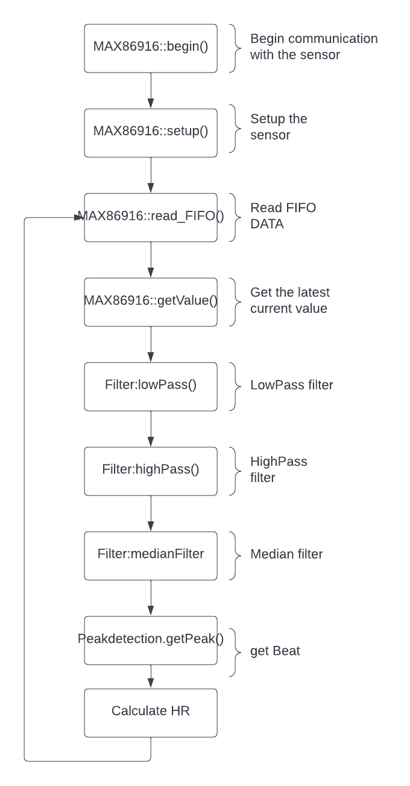

# IoT_Sensor
Electronics project of a biomedical sensor

## MAX86916
This GitHub project contains a library for configuring registers and reading data from the MAX86916 sensor to calculate heart rate (HR) using a peak detection algorithm. The MAX86916 is a highly integrated optical sensor module that can be used for pulse oximetry and heart rate monitoring. The library provided in this project simplifies the process of interfacing with the sensor and extracting the HR information using an efficient peak detection algorithm. The library can be easily integrated into an existing codebase, and the project also includes sample code to demonstrate the usage of the library.

## HR-Calculation

### Begin()
-Starts I2C communication by calling the Wire.begin() function.
-Sets the clock speed for the I2C communication to I2C_SPEED_FAST using the Wire.setClock() function.
-Calls the read_Part_ID() function to read the part ID from the MAX86916 sensor.
-Compares the part ID read from the sensor to the expected part ID (MAX86916_EXPECTED_PART_ID).
-If the part ID does not match the expected part ID, the function returns false, indicating an error.
-Calls the read_Revision_ID() function to read the revision ID from the MAX86916 sensor.
-If everything is working correctly, the function returns true.
### Setup()

### Read FIFO()
### Get Current value()
### Apply low pass filter
### Apply high pass filter
### Apply median filter
### Apply butterworth filter
### Peak detection algorithm
### Calculate HR

