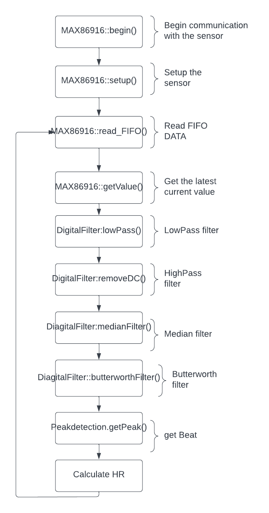

# IoT_Sensor

This GitHub project contains a library for configuring registers and reading data from the MAX86916 sensor to calculate heart rate (HR) using a peak detection algorithm. The MAX86916 is a highly integrated optical sensor module that can be used for pulse oximetry and heart rate monitoring. The library provided in this project simplifies the process of interfacing with the sensor and extracting the HR information using an efficient peak detection algorithm. The library can be easily integrated into an existing codebase, and the project also includes sample code to demonstrate the usage of the library.

## HR-Calculation

### Begin()
- Starts I2C communication between Arduino and sensor by calling the Wire.begin() function.
- Sets the clock speed for the I2C communication to I2C_SPEED_FAST using the Wire.setClock() function.
- Calls the read_Part_ID() function to read the part ID from the MAX86916 sensor.
- Compares the part ID read from the sensor to the expected part ID (MAX86916_EXPECTED_PART_ID).
- If the part ID does not match the expected part ID, the function returns false, indicating an error.
- Calls the read_Revision_ID() function to read the revision ID from the MAX86916 sensor.
- If everything is working correctly, the function returns true.
### Setup()
- Calls the softReset() function to reset the sensor.
- Configures the FIFO (First In First Out) buffer by calling the setFIFOAverage() function to set the sample average, and the enableFIFORollover() function to allow the FIFO to roll over.
- Configures the LED mode by calling the setLEDMode() function with the specified ledMode parameter. The activeLEDs variable is set based on the ledMode parameter.
- Configures the particle sensing by calling the setADCRange(), setSampleRate(), and setPulseWidth() functions with the specified parameters.
- Configures the LED pulse amplitude by calling the setAllLEDRange() function with the specified range parameter, and the setPA_IR(), setPA_RED(), setPA_GREEN(), setPA_BLUE(), and setPA_PROX() functions with the specified powerLevel parameter.
- Configures the Flex-LED mode by calling the enableSlot() function to enable the reading of the LEDs, depending on the ledMode parameter.
- Calls the clearFIFO() function to reset the FIFO buffer.
### Read FIFO()
- The function returns a 16-bit unsigned integer that represents the number of new data samples that were read from the sensor.
- The function first reads the read and write pointers of the FIFO register to determine how much new data is available.
- If there is new data available, the function calculates the number of samples to read and the number of bytes to request from the sensor.
- The function then enters a loop where it repeatedly requests blocks of data from the sensor and stores the data in the buffer.
- Within the loop, the function reads three bytes at a time and converts them to 32-bit unsigned integers.
- The function then applies a bit mask to zero out all but the 18 least significant bits of the integer, which are the meaningful data bits.
- Finally, the function stores the converted integer values in the appropriate arrays within the buffer.
### Get Current value()
This function is a method of a MAX86916 class that retrieves the most recent Green value from the sensor data buffer. It first calls the safeCheck() function, which checks the sensor for new data for 250ms and returns a boolean indicating whether new data was found. If new data is found, it returns the most recent Green value from the sensor_data_buffer array by accessing the array element at the current head index. If no new data is found, it returns 0 to indicate that the sensor failed to find new data. This function assumes that the sensor data buffer has been properly initialized and that the head index has been properly updated by the readFIFO() function.
### Apply lowpassfilter()
This function applies a first-order low-pass filter to the input signal using the one-pole recursive filter algorithm. The filter is implemented using a lowpassFilter1p struct that contains the previous input value and the filter coefficient (pt1K).
The function then updates the previous input value to the current output value for the next iteration of the filter.
Finally, the function returns the filtered output signal.
### Apply removeDC()
This function applies a DC removal filter to the input signal using a first-order high-pass filter with the given alpha coefficient. The function takes three parameters: the input signal to be filtered (x), the previous filtered value (prev_w), and the alpha coefficient (alpha) that determines the amount of filtering.
The function creates a DigitalFilter::dcFilter_t struct to hold the filtered and intermediate values, and returns the filtered value at the end.
### Apply medianfilter()
This function applies a mean difference filter to the input signal using a sliding window of a specified size. The function takes two parameters: the input signal to be filtered (M), and a pointer to the meanDiffFilter_t struct (filterValues) containing the filter parameters.
The function calculates the filtered output signal as the difference between the input signal and the moving average of the window. The filter parameters include an array of values (values), the sum of the values (sum), the index of the current position in the sliding window (index), and the count of values in the sliding window (count).
The function first subtracts the oldest value in the sliding window from the sum. It then inserts the new value at the current index and adds it to the sum. The index is then moved to the next position in the sliding window. If the sliding window is not full, the count of values in the window is increased.
The function calculates the moving average of the window by dividing the sum by the count. It then returns the difference between the moving average and the input signal.
### Apply butterworthfilter()
This function applies a fourth-order low-pass filter to the input signal using pre-calculated filter coefficients. The coefficients were calculated in Matlab based on some samples of the input signal.
The filter has four zeros (NZEROS) and four poles (NPOLES), and a gain factor (GAIN) of 3.775352055e+02.
The function uses two arrays, xv and yv, to maintain a history of the input and output values, respectively. The input value x is first scaled by the pre-calculated gain and then inserted into the input history buffer.
The output history buffer is shifted, and the new output value is calculated using the pre-calculated filter coefficients and the history buffer values. The function returns the new output value.
Note that the filter coefficients and the gain factor were pre-calculated in Matlab and are hardcoded in the function.
### Peak detection algorithm
After the signal was filtered, the next step was to apply the peak detection algorithm to the filtered signal. This algorithm identified the peaks in the signal, which corresponded to the heartbeats.
### Calculate HR
For each peak found, the time between the different peaks was calculated to determine the heart rate
